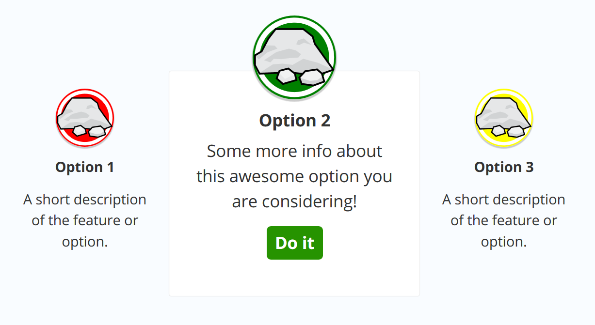

# CSS Animation - Reveal Content On Hover

In this CSS Animation project, we start off with unstyled option boxes. Then we plan initial state of these option boxes by hiding certain elements and scaling down.

When option boxes in highlighted state, we apply specific styles to make it stand out. Then we use JavaScript to add and remove highlighted class when option boxes in on hover.

Lastly we apply transition effect to the boxes to make it even more interesting!

[View demo site here.](http://edwinchen.co/css_animation_reveal_content_on_hover/)

